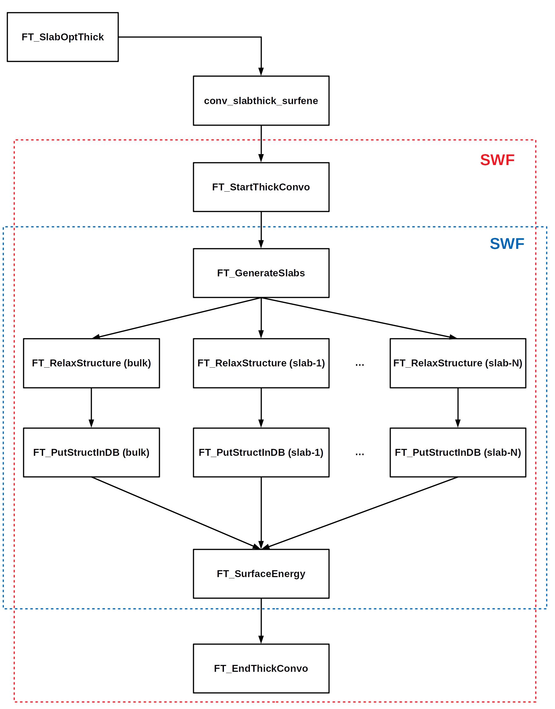

# Convergece slab thickness

## Introduction

**Goal**
This is a workflow to calculate the optimal thickness for a slab of a given material with a specific orientation.

**Context**
DFT simulations usually take a long time to complete, so it is essential to optimize the structural and computational parameters of the calculations. In the case of a slab it is fundamental to provide a correct estimate of its minimum thickness in order to avoid huge slowdown in vasp simulations and not to waste CPU time.
 To estimate it we propose to converge the surface energy or the lattice parameter with respect to the number of atomic layers. 

**Implementation**
At the moment, our code implements the convergence of a slab thickness via the evaluation of its surface energy. This is supposed to work properly only with bulks with mono-atomic basis presenting symmetric slab terminations, i.e.  materials from the periodic tables.

## Workflow structure

It is possible to use our code both as a single workflow, which scan for the bulk which are saved in a given database and converge the slab thickness for a given miller index, or as a subworkflow called by other workflow as intermediate step.

A schematic representation of our subworkflow is reported in the figure above. Now, a description of the main Firetasks as well as the list of required and optional parameters is made:

1. **FT_SlabOptThick**: Firetasks to start a subworkflow within another workflow. Check if a specific slab saved in the high level database, and identified by an mpid and a set of miller index, has a *opt_thickness* option already present. If not present it starts a subworklow to converge the slab thickness, either via surface energy or lattice parameter (not yet implemented).
The required and optional parameters are:
	- **required_params** = ['mp_id', 'miller', 'functional']
	- **optional_params** = ['db_file', 'low_level', 'high_level', 'relax_type', 'convo_kind', 'thick_start', 'thick_incr', 'nsteps', 'bulk_name', 'slab_name']

2. **conv_slabthick_surfene**: Function to start a subworkflow. Set the computational and cluster parameters and open a subworkflow.

3. **FT_StartThickConvo**: Firetask to start a detour to relax the bulk and the slabs with different numbers of layers. The data are retrieved from the provided database, the local one as the default.
	- **required_params** = ['structure', 'mp_id', 'miller', 'functional']
	- **optional_params** = ['db_file', 'collection', 'comp_params', 'convo_kind', 'relax_type', 'thick_start', 'thick_incr', 'nsteps',  'vacuum', 'ext_index', 'bulk_name', 'slab_name']

4. **FT_GenerateSlabs**: Create all the necessary inputs for the slabs and save them in the local database, in order to retrieve them later. You can pass a bulk strcture and a list (of dictionary) containing the required options to feed SlabGenerator.
	- **required_params** = ['structure', 'mp_id', 'miller', 'functional']
	- **optional_params** = ['db_file', 'collection', 'thickness',  'vacuum', 'ext_index', 'symmetrize', 'slab_name']

5. **FT_RelaxStructure**: Generically relax a structure which is passed as input, such as bulks, slabs and interfaces. Before doing the relaxation it checks if the calculation has been already done previously calculated and stored on databases. It stores the final data on the provided database, the local one as the default.
	- **required_params** = ['mp_id', 'functional', 'struct_kind']
	- **optional_params** = ['comp_params', 'miller', 'name', 'db_file', 'collection', 'relax_type']

6. **FT_PutStructInDB**: Retrieve the relaxed structure and store them in the provided Database.
	- **required_params** = ['mp_id', 'functional', 'tag', 'struct_kind']
	- **optional_params** = ['miller', 'name', 'db_file', 'cluster_params']

7. **FT_SurfaceEnergy**: Generically calculate the surface energy of a given slab (or a list of slabs) with respect to the corresponding bulk.

8. **FT_EndThickConvo**: End the calculation of the optimal slab thickness. It finds out the optimal surface energy and the corresponding number of atomic layers. It stores on the high level db the relaxed slab, its surface energy and optimal thickness. 

