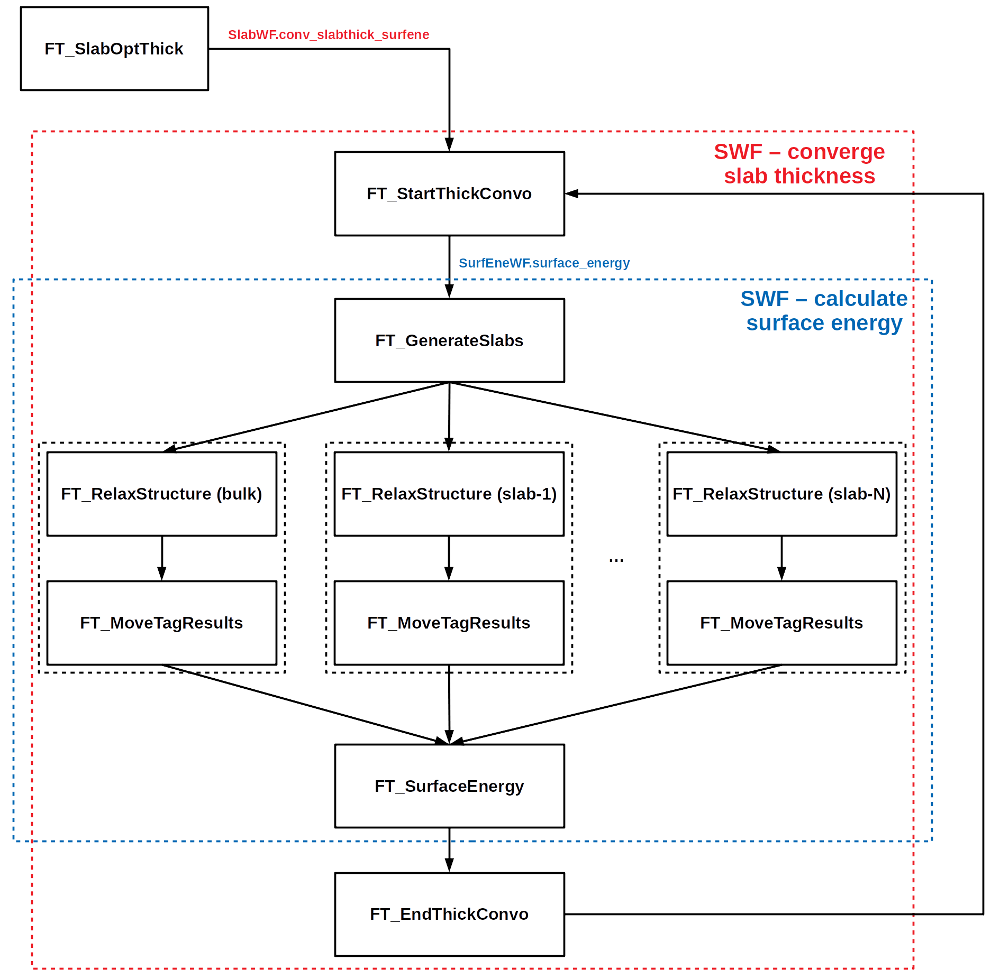

# Convergece slab thickness

## Introduction

**Goal**
This is a workflow to calculate the optimal thickness for a slab of a given material with a specific orientation.

**Context**
DFT simulations usually take a long time to complete, so it is essential to optimize the structural and computational parameters of the calculations. In the case of a slab it is fundamental to provide a correct estimate of its minimum thickness in order to avoid huge slowdown in vasp simulations and not to waste CPU time.
 To estimate it we propose to converge the surface energy or the lattice parameter with respect to the number of atomic layers. 

**Implementation**
At the moment, our code implements the convergence of a slab thickness via the evaluation of its surface energy. This is supposed to work properly only with bulks with mono-atomic basis presenting symmetric slab terminations, i.e.  materials from the periodic tables.

## Workflow structure

It is possible to use our code both as a single workflow, which scan for the bulk which are saved in a given database and converge the slab thickness for a given miller index, or as a subworkflow called by other workflow as intermediate step.

A schematic representation of our subworkflow is reported in the figure above. Now, a description of the main Firetasks as well as the list of required and optional parameters is made:

1. **FT_SlabOptThick**: Firetasks to start a subworkflow within another workflow. You need to pass a lattice parameter trova il parametro thickness a
Convergenza allora fa il detour 
	- required_params = ['mp_id', 'miller', 'functional'] .
	- optional_params = ['db_file', 'high_level', 'relax_type', 'convo_kind', 'bulk_name', 'slab_name']

2. **conv_slabthick_surfene**: Controlla I parametri e apre un subworkflow fatto solo di optimal thickness + store data in db

3. **FT_GenerateSlabs**: Creo tutti gli input e li salvo nel database locale, in modo da poterli richiamare più tardi
→ Tu gli passi una lista di strutture (bulk) e una lista di dizionari contenente le opzioni che vuoi per SlabGenerator. Ti crea tutto e ti carica sul db locale (o di alto livello) [creare default da qualche parte]. Flag: type_of_relax=relax (default è None)

4. **FT_StartThickConvo**: Initial Firetasks of the real subworkflow wh

5. **FT_RelaxStructure**: Ognuno rilassa una struttura di competenza e salva tutto sul database locale. Controlla sul database locale più ogni database di alto livello che gli passi se la struttura che vuoi calcolare è stata già calcolata

6. **FT_SurfaceEnergy**: Calcola la surface energy raccogliendo tutti I dati che sono stati salvati,

7. **FT_EndThickConvo**: Calcola la surface energy ottimale, seleziona la struttura slab corrispondente, così come il bulk e carica tutto sul db di alto livello

